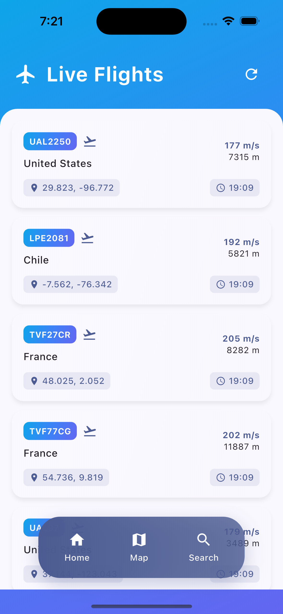
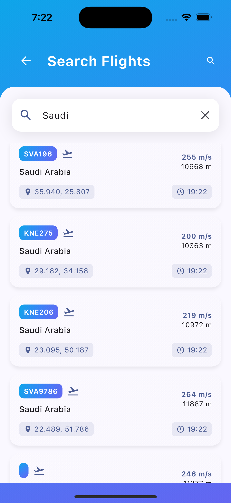

<div align="center">

# ✈️ TrackSky

### Real-time global flight tracking powered by OpenSky Network

[](https://flutter.dev)
[](https://dart.dev)
[](https://riverpod.dev)
[](https://opensky-network.org)
[](LICENSE)
[](https://flutter.dev)

**Track thousands of live flights across the globe — on a map, in a list, or by country.**

</div>

---

## 📖 Overview

**TrackSky** is a cross-platform Flutter application that displays real-time flight data sourced from the [OpenSky Network API](https://opensky-network.org). Users can browse live flights in a scrollable list, search by country of origin, and visualize all active aircraft on an interactive world map with their current positions, altitude, speed, and heading.

---

## 📸 Screenshots

<div align="center">

### 🛫 Live Flights



---

### 🔍 Search Flights



---

### 📋 Flight Details


</div>

---

## ✨ Features

| Feature | Description |
|---|---|
| 🌍 **Live Flight List** | Scrollable list of all active flights fetched from OpenSky Network |
| 🗺️ **Interactive Map** | Full-screen flight map with aircraft markers and tap-to-select |
| 🔍 **Search by Country** | Filter flights by country of origin with real-time results |
| 📋 **Flight Details** | ICAO24, callsign, altitude, speed, heading, vertical rate, and status |
| 📍 **User Location** | GPS location support with map centering on your position |
| 🌙 **Light & Dark Theme** | Automatic system theme switching |
| ✨ **Smooth Animations** | Entry animations on all list items and screens via `flutter_animate` |
| 🌐 **Cross-Platform** | Runs on Android, iOS, Web, macOS, Windows, and Linux |

---

## 🏗️ Architecture

TrackSky follows **Clean Architecture** with three distinct layers:

```text
Presentation Layer   →  Screens, Widgets, Providers (Riverpod)
Domain Layer         →  Entities, Repository Interface, Use Cases
Data Layer           →  Models (Freezed), Repository Implementation, Dio HTTP
```

### Layer Breakdown

```text
lib/
├── core/
│   ├── constants/app_constants.dart    # API URL, timeouts, country list, FlightUtils
│   ├── router/app_router.dart          # GoRouter navigation
│   └── theme/app_theme.dart            # Light/dark themes, gradients
│
├── data/
│   ├── models/
│   │   ├── flight_model.dart           # Freezed model + fromList() for OpenSky array format
│   │   ├── flight_model.freezed.dart   # Generated
│   │   └── flight_model.g.dart         # Generated
│   └── repositories/
│       └── flight_repository_impl.dart # Dio HTTP → OpenSky API
│
├── domain/
│   ├── entities/flight_entity.dart     # typedef FlightEntity = FlightModel
│   ├── repositories/flight_repository.dart  # Abstract interface
│   └── usecases/get_all_flight.dart    # GetAllFlightsUseCase
│
└── presentation/
    ├── providers.dart                  # Riverpod providers (Dio, repo, flights, location)
    ├── screens/
    │   ├── home_screen.dart            # Live flight list
    │   ├── search_screen.dart          # Country search
    │   ├── map_screen.dart             # Interactive flutter_map
    │   └── flight_details_screen.dart  # Full flight info
    └── widgets/
        ├── flight_card.dart            # List item card
        ├── enhanced_flight_card.dart   # Detailed card variant
        ├── flight_marker.dart          # Map aircraft marker
        ├── map_controls.dart           # Map zoom/locate controls
        ├── map_legend.dart             # Map status legend
        ├── gradient_app_bar.dart       # Themed app bar
        └── floating_navigation.dart    # Bottom nav bar
```

---

## 🔌 API

TrackSky uses the **OpenSky Network REST API** — free, no authentication required for anonymous access.

| Endpoint | Used For |
| ----------------------------- | -------------------------------------------------- |
| `GET /states/all` | Fetch all active flights worldwide |
| `GET /states/all?icao24=<id>` | Fetch a specific flight by ICAO24 transponder code |

OpenSky returns flight state vectors as raw arrays. `FlightModel.fromList()` maps each positional index to a typed field:

```text
[icao24, callsign, originCountry, timePosition, lastContact,
 longitude, latitude, baroAltitude, onGround, velocity,
 trueTrack, verticalRate, sensors, geoAltitude, squawk, spi, positionSource]
```

---

## 🚀 Getting Started

### Prerequisites

* Flutter SDK `^3.x`
* Dart SDK `^3.7.0`

No API key required — OpenSky Network's anonymous tier is free.

### Installation

```bash
# 1. Clone the repository
git clone https://github.com/nmustakim/TrackSky.git
cd TrackSky

# 2. Install dependencies
flutter pub get

# 3. Generate Freezed models
dart run build_runner build --delete-conflicting-outputs

# 4. Run the app
flutter run
```

### Build

```bash
# Android
flutter build apk --release

# iOS
flutter build ios --release

# Web
flutter build web --release
```

---

## 🛠️ Tech Stack

| Category | Technology | Version |
| ---------------- | ------------------------------- | ----------------- |
| Framework | Flutter | 3.x |
| Language | Dart | ^3.7.0 |
| State Management | Riverpod (`flutter_riverpod`) | ^2.4.9 |
| Navigation | GoRouter | ^12.1.3 |
| HTTP Client | Dio | ^5.4.0 |
| Map | flutter_map + latlong2 | latest |
| Code Generation | Freezed + json_serializable | ^2.4.6 / ^6.7.1 |
| Animations | flutter_animate | ^4.5.0 |
| Location | geolocator + permission_handler | ^10.1.0 / ^11.1.0 |
| Fonts | google_fonts | ^6.1.0 |
| Image Caching | cached_network_image | ^3.3.0 |

---

## 🗺️ Flight Data Fields

Each tracked flight exposes:

| Field | Description |
| ------------------------ | -------------------------------------------- |
| `icao24` | Unique ICAO 24-bit transponder address |
| `callsign` | Flight callsign (e.g. `BAW123`) |
| `originCountry` | Country of registration |
| `latitude` / `longitude` | Current GPS position |
| `baroAltitude` | Barometric altitude (metres) |
| `geoAltitude` | Geometric altitude (metres) |
| `velocity` | Ground speed (m/s → converted to km/h) |
| `trueTrack` | Heading in degrees (converted to N/NE/E/SE…) |
| `verticalRate` | Climb/descent rate (m/s) |
| `onGround` | Whether the aircraft is on the ground |
| `squawk` | Transponder squawk code |

---

<div align="center">

Built with ❤️ using Flutter & OpenSky Network

⭐ Star this repo if you found it useful!

</div>
